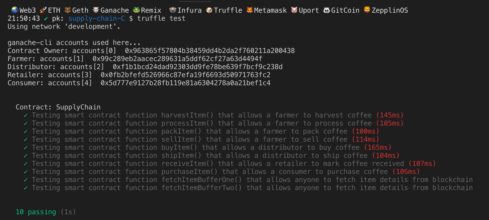

# Project Submission Attributes

Truffle v5.5.15 (core: 5.5.15)  
Ganache v^7.1.0  
Solidity - 0.8.13 (solc-js)  
Node v16.15.0  
Web3.js v1.5.3  
@truffle/hdwallet-provider  
truffle-assertions  
  
# Rinkeby Contract Address
https://rinkeby.etherscan.io/address/0x71C12fd30C175dAafa0c47E12AC0cD5B7D317Ab3  
0x71C12fd30C175dAafa0c47E12AC0cD5B7D317Ab3

## Project write-up UML


## Libraries
No additional libraris used.

## IPFS
not used.

## General writeup  
The template code for the farmers “supply chain” stage provides 8 core steps and associated data structures to automatically track via smart contract the cycle of any food product from harvest to customer sale.  The states traversed to execute smart contract deliver tracking of an item from the farmer to the consumer are defined for the purposes of this supply chain as Harvested, Processed, Packed, ForSale, Sold, Shipped, Received, and finally Purchased. The real-world execution of this process requires data input to track the harvested goods as they are transformed into sellable goods and finally delivered.  

## Test Smart Contract  


## Deploy Rinkeby  
https://rinkeby.etherscan.io/address/0x71C12fd30C175dAafa0c47E12AC0cD5B7D317Ab3  

PS D:\Udacity\Home\Workspace\SupplyChain\project-6> truffle migrate --network rinkeby --reset

Compiling your contracts...
===========================
> Compiling .\contracts\Migrations.sol
> Compiling .\contracts\coffeeaccesscontrol\ConsumerRole.sol
> Compiling .\contracts\coffeeaccesscontrol\DistributorRole.sol
> Compiling .\contracts\coffeeaccesscontrol\FarmerRole.sol
> Compiling .\contracts\coffeeaccesscontrol\RetailerRole.sol
> Compiling .\contracts\coffeeaccesscontrol\Roles.sol
> Compiling .\contracts\coffeebase\SupplyChain.sol
> Compiling .\contracts\coffeebase\SupplyChain.sol
> Compiling .\contracts\coffeecore\Ownable.sol
> Artifacts written to D:\Udacity\Home\Workspace\SupplyChain\project-6\build\contracts
> Compiled successfully using:
   - solc: 0.8.13+commit.abaa5c0e.Emscripten.clang


Starting migrations...
======================
> Network name:    'rinkeby'
> Network id:      4
> Block gas limit: 29999972 (0x1c9c364)


1_initial_migration.js
======================

   Replacing 'Migrations'
   ----------------------
   > transaction hash:    0x0f55651fd69e3af153817f8a31eaf73467c0b9f9dcb93268a22d1124de8563f8
   > Blocks: 1            Seconds: 8
   > contract address:    0xC30BB29dD22CDe30d190e39440845df732d25541
   > block number:        10721956
   > block timestamp:     1653245614
   > account:             0xE768c5Dc0f22CFe7Ec0C3E09906D848e28a8A736
   > balance:             0.388790760071371734
   > gas used:            274088 (0x42ea8)
   > gas price:           10 gwei
   > value sent:          0 ETH
   > total cost:          0.00274088 ETH

   > Saving migration to chain.
   > Saving artifacts
   -------------------------------------
   > Total cost:          0.00274088 ETH


2_deploy_contracts.js
=====================

   Replacing 'FarmerRole'
   
   ...  See TruffleMigrate.txt for full txt  
   
     > Saving migration to chain.
   > Saving artifacts
   -------------------------------------
   > Total cost:          0.04942757 ETH

Summary
=======
> Total deployments:   7
> Final cost:          0.05216845 ETH  

  
  
## Infura Transactions Statistics  


## -- Original Contenet below:  

# Supply chain & data auditing

This repository containts an Ethereum DApp that demonstrates a Supply Chain flow between a Seller and Buyer. The user story is similar to any commonly used supply chain process. A Seller can add items to the inventory system stored in the blockchain. A Buyer can purchase such items from the inventory system. Additionally a Seller can mark an item as Shipped, and similarly a Buyer can mark an item as Received.

The DApp User Interface when running should look like...


## Getting Started

These instructions will get you a copy of the project up and running on your local machine for development and testing purposes. See deployment for notes on how to deploy the project on a live system.

### Prerequisites

Please make sure you've already installed ganache-cli, Truffle and enabled MetaMask extension in your browser.

```
Give examples (to be clarified)
```

### Installing

> The starter code is written for **Solidity v0.4.24**. At the time of writing, the current Truffle v5 comes with Solidity v0.5 that requires function *mutability* and *visibility* to be specified (please refer to Solidity [documentation](https://docs.soliditylang.org/en/v0.5.0/050-breaking-changes.html) for more details). To use this starter code, please run `npm i -g truffle@4.1.14` to install Truffle v4 with Solidity v0.4.24. 

A step by step series of examples that tell you have to get a development env running

Clone this repository:

```
git clone https://github.com/udacity/nd1309/tree/master/course-5/project-6
```

Change directory to ```project-6``` folder and install all requisite npm packages (as listed in ```package.json```):

```
cd project-6
npm install
```

Launch Ganache:

```
ganache-cli -m "spirit supply whale amount human item harsh scare congress discover talent hamster"
```

Your terminal should look something like this:


In a separate terminal window, Compile smart contracts:

```
truffle compile
```

Your terminal should look something like this:


This will create the smart contract artifacts in folder ```build\contracts```.

Migrate smart contracts to the locally running blockchain, ganache-cli:

```
truffle migrate
```

Your terminal should look something like this:


Test smart contracts:

```
truffle test
```

All 10 tests should pass.



In a separate terminal window, launch the DApp:

```
npm run dev
```

## Built With

* [Ethereum](https://www.ethereum.org/) - Ethereum is a decentralized platform that runs smart contracts
* [IPFS](https://ipfs.io/) - IPFS is the Distributed Web | A peer-to-peer hypermedia protocol
to make the web faster, safer, and more open.
* [Truffle Framework](http://truffleframework.com/) - Truffle is the most popular development framework for Ethereum with a mission to make your life a whole lot easier.


## Authors

See also the list of [contributors](https://github.com/your/project/contributors.md) who participated in this project.

## Acknowledgments

* Solidity
* Ganache-cli
* Truffle
* IPFS
